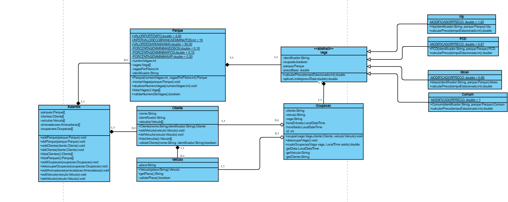
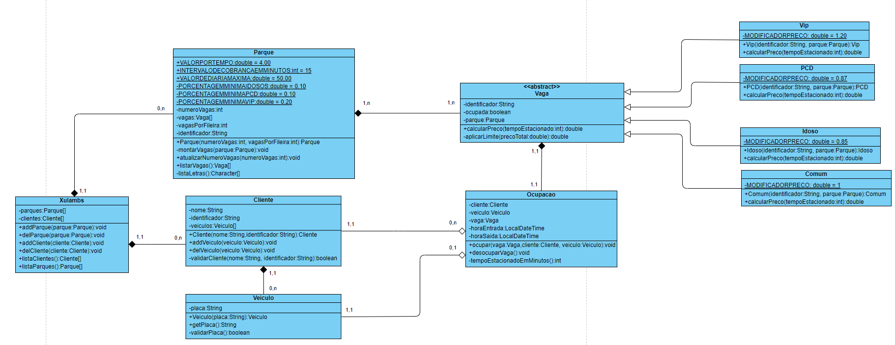
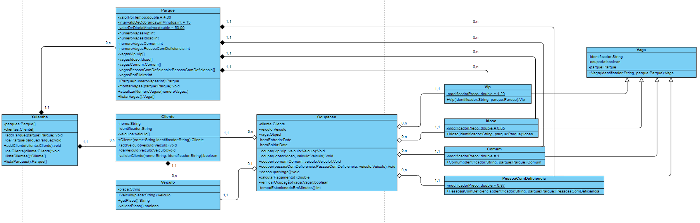
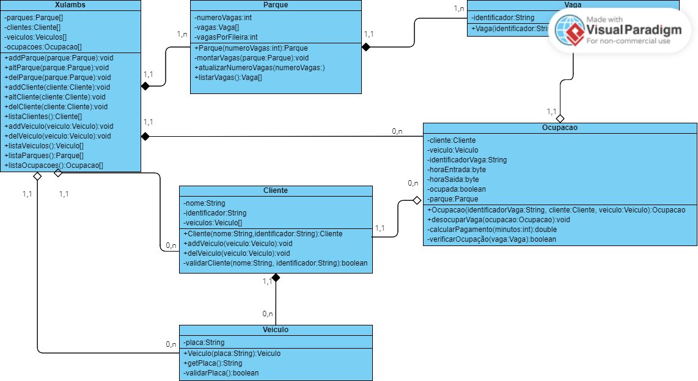
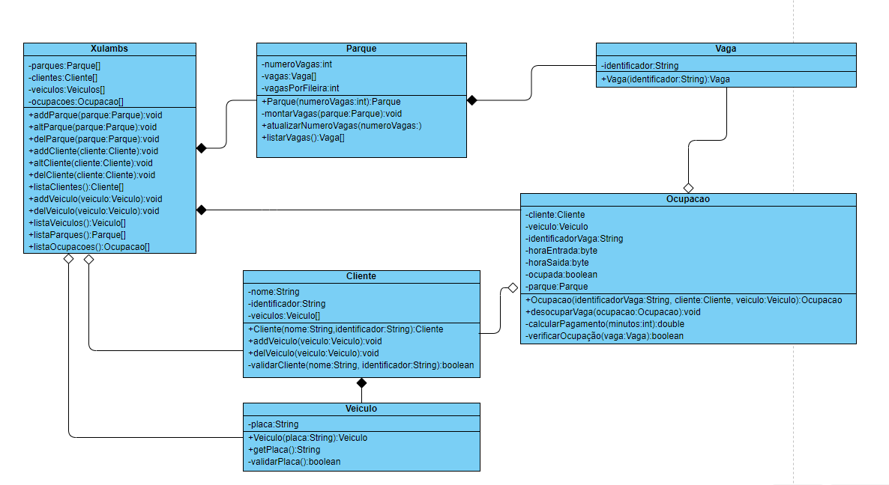
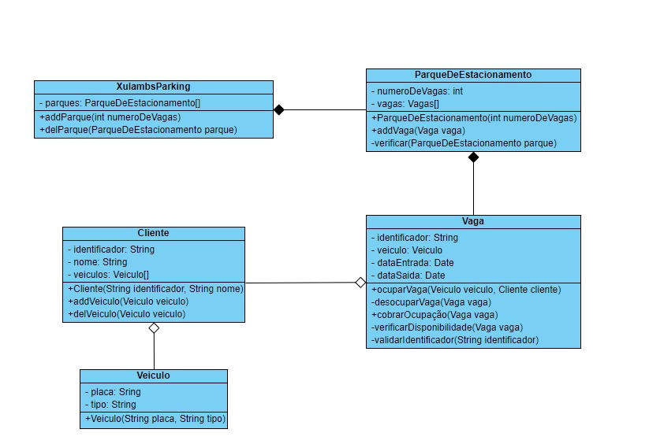

# Diagramas de classe
Coloque aqui todas as versões do seu diagrama de classes. Cada versão deve começar com um número de dois dígitos, na ordem crescente.

## - Versão 0.5

## - Versão 0.4

## - Versão 0.3

## - Versão 0.2.1

## - Versão 0.2

## - Versão 0.1

